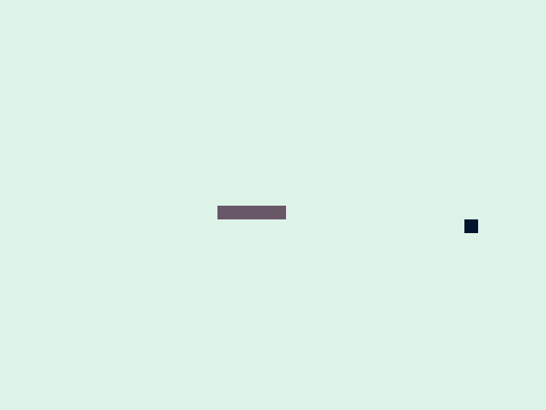

# Snake Game with Rust and Piston

My implementation of the classic snake game in Rust using the Piston game
engine described [here](https://www.youtube.com/watch?v=HCwMb0KslX8).

## Running the game

1. Compile the package
```
$ cargo build
```

2. Run the game
```
$ cargo run
```

## Features/Behavior and Controls

### Features/Behavior

- Collison with the snakes tail or a wall stops the game
- The best score of the session is recorded
- The score is displayed in the terminal from where the program was started

### Controls

- Standard arrow keys to control the movement of the snake
- [ESC] to quit the window anytime
- [SPACE] to restart the game after a collision

## Generating documentation

The documentation for the modules can be generated with the command

```
$ cargo doc --open
```

## Screenshot


